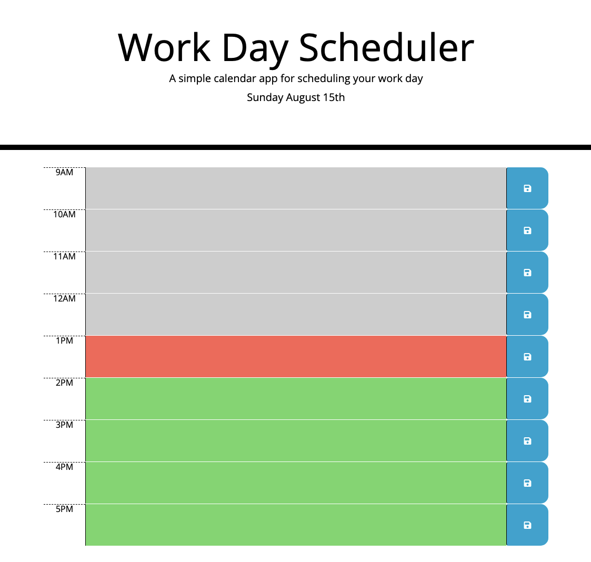

# Work Day Scheduler

## Description
Work Day Scheduler is a daily planner that displays past hours in grey, the present hour in red, and future hours in green. Text written in each time block will be saved to local storage upon clicking the save icon to the right. Refreshing the page will continue to display the previously saved items.

## Built With
* HTML
* CSS
* Javascript
* JQuery
* Moment
* Bootstrap

## Website
https://wamackie.github.io/work-day-scheduler/

## Credits
Work Day Scheduler was created by William Mackie
